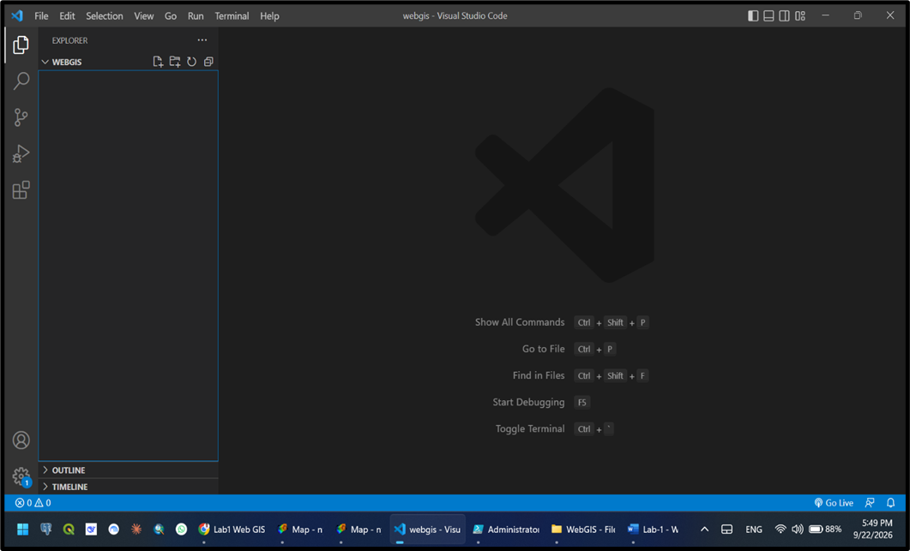
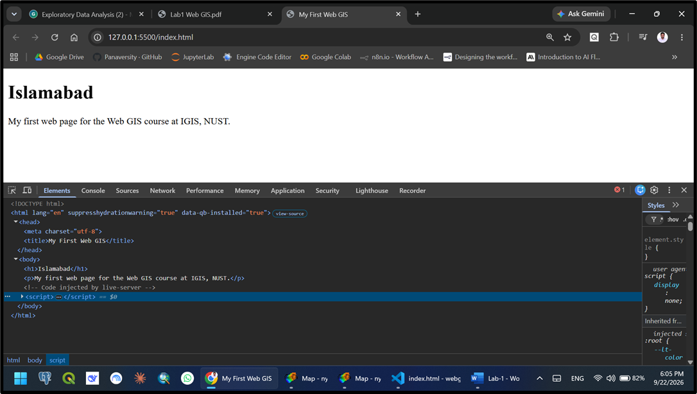
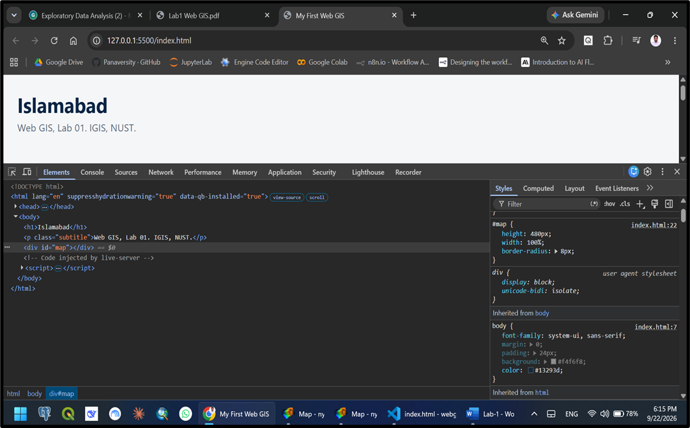
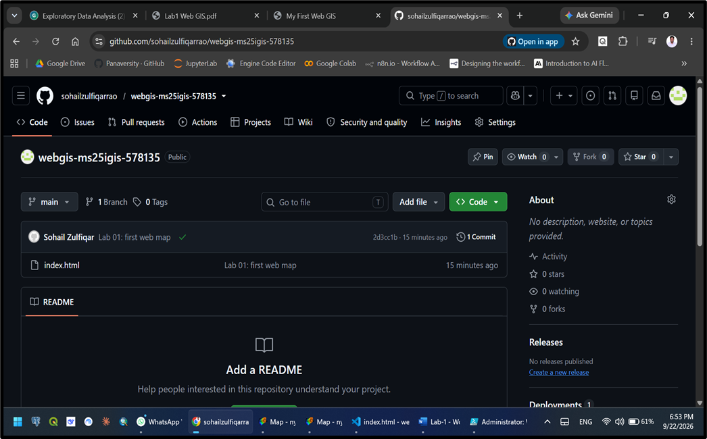
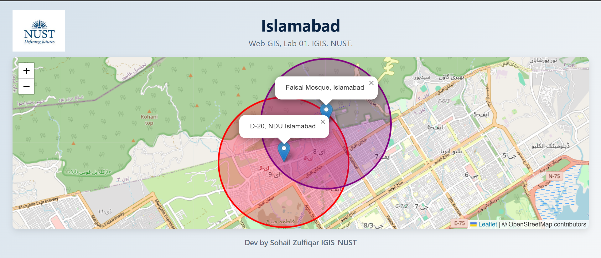

!

1.	Change in network requests: Initially, the browser only made a single request for the index.html file. After adding the Leaflet script, the browser makes dozens of requests to fetch individual 256 by 256 pixel background map tile images. This happens because the map is not a static picture, but rather an ongoing conversation with a server that loads new tiles as the map is viewed or panned. 
2.	HTML vs. CSS: HTML dictates what content exists on the page, whereas CSS controls how that content looks. An example of HTML is <h1>Islamabad</h1>, which structuralizes text as a top-level heading. An example of CSS is the #map rule (height: 480px; width: 100%;), which defines the dimensions and appearance of the map container. 
3.	Height requirement for #map: An empty 
 tag has a default height of zero. If the #map CSS rule does not specify a height, Leaflet will draw the map into a box that is zero pixels tall, making it completely invisible on the page. 
4.	Using Live Server: Browsers have security measures that block data file requests for pages opened directly from the local file system. Running the page through Live Server provides a real local web environment, ensuring map data loads properly instead of silently failing. 
5.	Marker in the sea: The latitude and longitude coordinates are swapped. Leaflet's functions expect coordinates in (latitude, longitude) order. To fix this, reverse the order of the two coordinate numbers provided to the marker. 